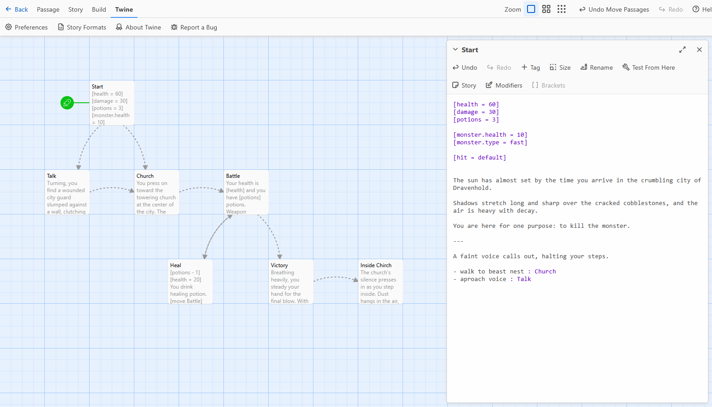

# Twine



**Twine** can be used as a visual editor for writing **Harrow** stories.

By using a custom Twine story `format.js`, scenes can be tested interactively and then exported as `.twee` files for use in Harrow.

The format includes syntax highlighting and a toolbar for inserting common Harrow commands.

Passage relationships are visualized through reference links. Classic Twine-style links using double square brackets are also supported and handled automatically by `harrow.twine.Parser`.

To use the format, install it in Twine like any other custom format.

### Story format URL

```
https://nayata.github.io/format/format.js
```

### More information about Twine formats

* [Story Formats](https://twinery.org/reference/en/getting-started/basic-concepts.html#story-formats)

* [Adding a Story Format](https://twinery.org/reference/en/story-formats/adding.html)